# BDR Labo 1 : Modélisation conceptuelle

Le fichier SQL contenant les requêtes se trouve à la racine du ZIP.

Certaines requêtes mises en commentaires ont été utiles pour vérifier l'exécution des requêtes modifiant la databse.
Le résultat retourné, et donc attendu, et mis en commentaires à droite de chacun de ces requêtes.

### 1

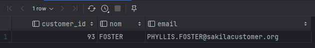

### 2

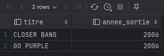

### 3

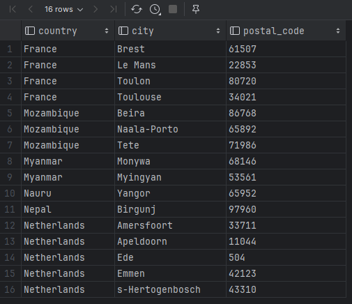

### 4

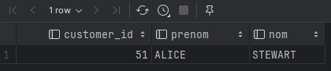

### 5

Nous avons décidé qu'une paire AB est égale à une paire BA. 
Sans quoi la requête enverrait un doublon pour chaque paire.

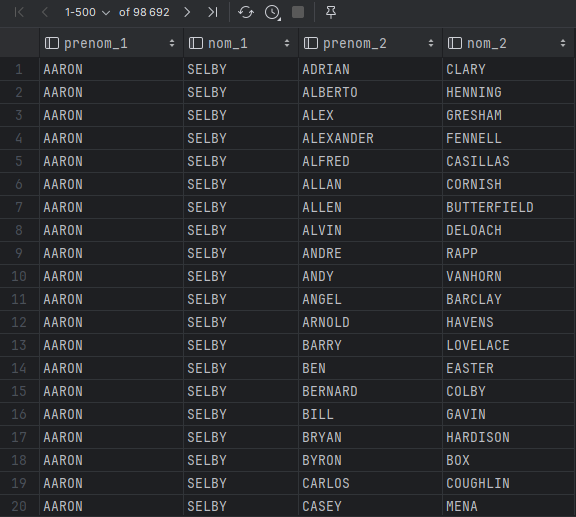

### 6

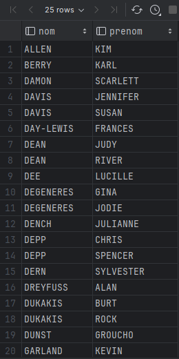

### 7a

Le rental_rate est le prix pour une rental_duration. 
rental_duration est en jour.

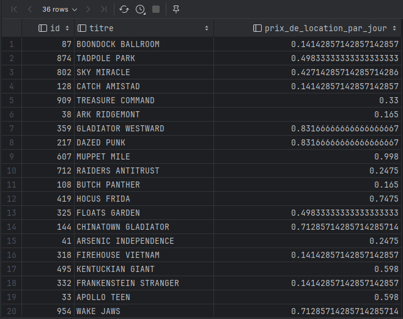

### 7b

Les résultats entre 7a et 7b ne sont pas dans le même ordre car aucune consigne à cet égard n'a été spécifié.

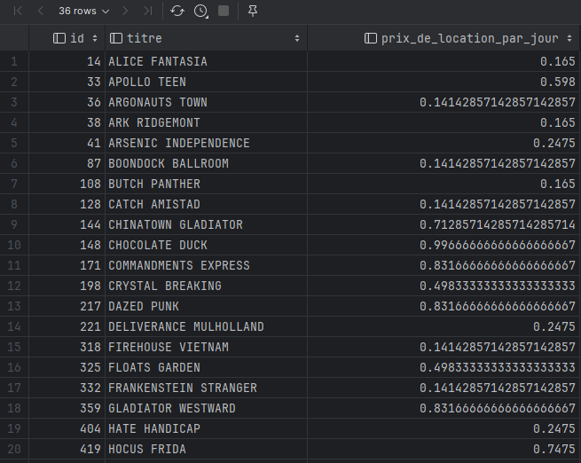

### 8a/8b/8c

Les trois requêtes renvoient le même résultat.

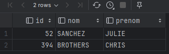

### 9

Un seul client a loué tous les films de l'actrice Emily Dee.

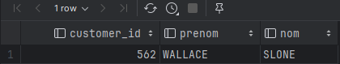

### 10

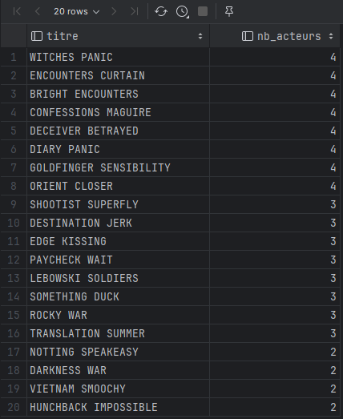

### 11

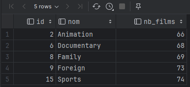

### 12

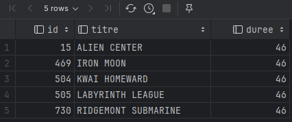

### 13a/13b

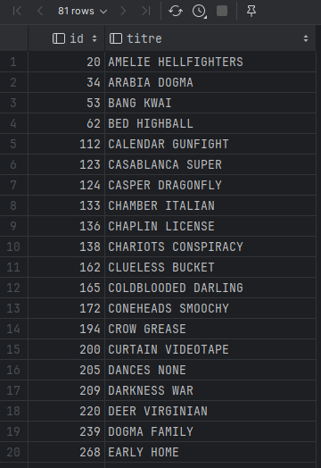

### 14

length est en minutes.
La conversion minutes en jours revient à diviser par 60 * 8.

Il faudrait 240 jours pour visionner l'entiéreté des films.

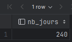

### 15

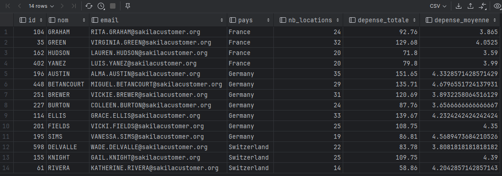

### 16a

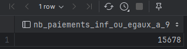

### 16c

Comme prévu, le nombre de paiements sont égaux à 0.

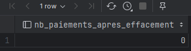

### 18b

Car l'id est un serial et est géré donc par la base de donnée afin de préserver l'unicité.

### 18d

Les résultats à droite sont non relevants et ont donc été tronqués (en raison de largeur d'écran déficiente).

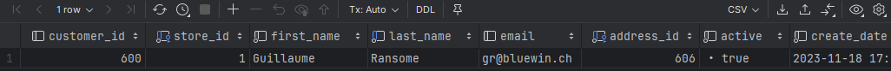
